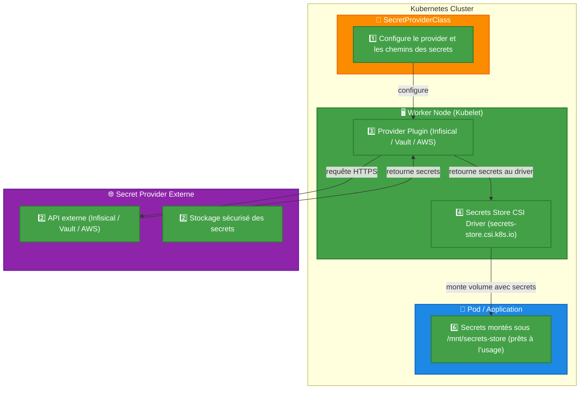

# secret-store-csi-driver

# Architecture

```mermaid
flowchart TD
    %% Définition des couleurs
    classDef k8s fill:#1E88E5,stroke:#1565C0,stroke-width:2px,color:#fff;
    classDef node fill:#43A047,stroke:#2E7D32,stroke-width:2px,color:#fff;
    classDef external fill:#8E24AA,stroke:#6A1B9A,stroke-width:2px,color:#fff;
    classDef config fill:#FB8C00,stroke:#EF6C00,stroke-width:2px,color:#fff;

    %% Sous-ensembles
    subgraph K8s["Kubernetes Cluster"]
        direction TB

        subgraph Pod["🧩 Pod / Application"]
            direction TB
            P1["6️⃣ Secrets montés sous /mnt/secrets-store (prêts à l’usage)"]
        end
        class Pod k8s

        subgraph Node["🖥️ Worker Node (Kubelet)"]
            direction TB
            D1["4️⃣ Secrets Store CSI Driver (secrets-store.csi.k8s.io)"]
            D2["3️⃣ Provider Plugin (Infisical / Vault / AWS)"]
        end
        class Node node

        subgraph SPC["🧾 SecretProviderClass"]
            direction TB
            C1["1️⃣ Configure le provider et les chemins des secrets"]
        end
        class SPC config
    end

    subgraph Ext["🌐 Secret Provider Externe"]
        direction TB
        E1["2️⃣ API externe (Infisical / Vault / AWS)"]
        E2["2️⃣ Stockage sécurisé des secrets"]
    end
    class Ext external

    %% Relations principales (numérotation reflétant l'ordre réel)
    C1 -->|configure| D2
    D2 -->|requête HTTPS| E1
    E1 -->|retourne secrets| D2
    D2 -->|retourne secrets au driver| D1
    D1 -->|monte volume avec secrets| P1

```